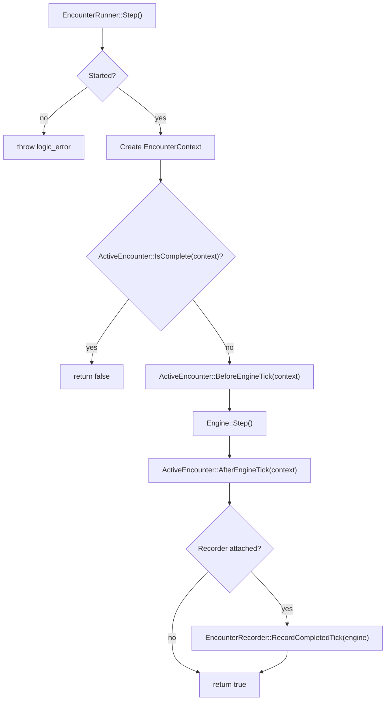
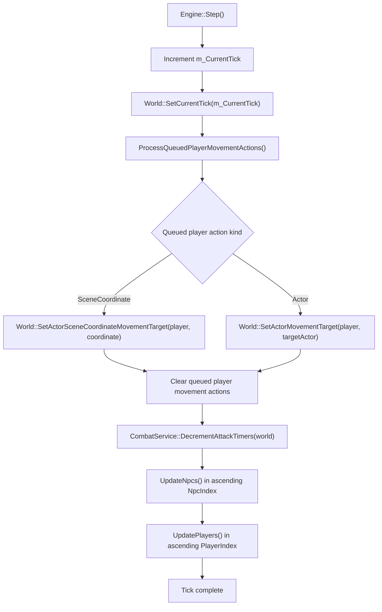
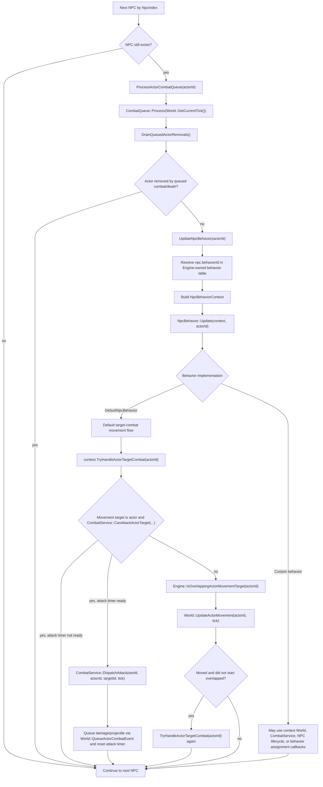
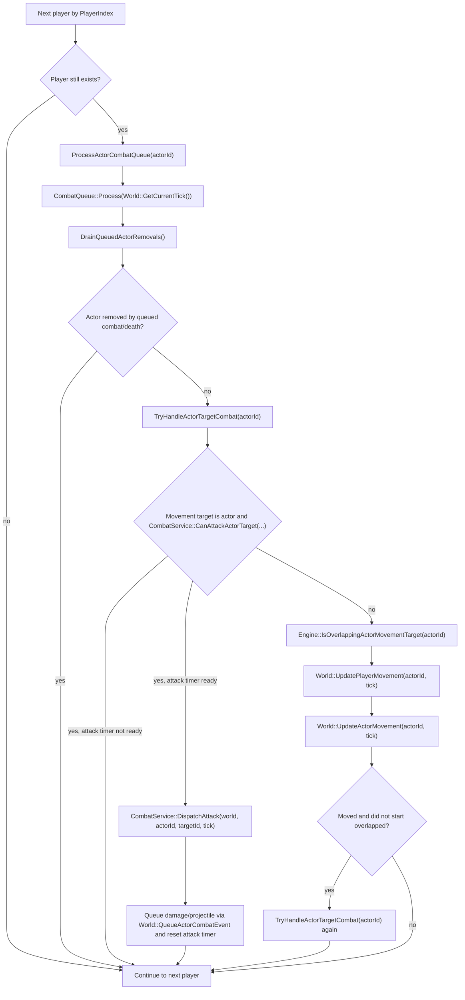

# Tick Update Flow

This note describes the current live simulation tick path for players and NPCs.
`EncounterRunner` owns encounter orchestration, while `Engine` owns generic tick
execution.

## Encounter Step

## Engine Tick Order

## NPC Update

Each live NPC is selected by `World::GetNextNpcActorIdAfterIndex`, so
`NpcIndex` controls NPC update order.

## Player Update

Each live player is selected by `World::GetNextPlayerActorIdAfterIndex`, so
`PlayerIndex` controls player update order. Players do not resolve an
`NpcBehavior`; after combat queue processing they run the same target-combat
then movement pattern directly in `Engine::UpdatePlayers`.

## Service Calls By Purpose

| Purpose | Service or owner | Called when |
| --- | --- | --- |
| Encounter lifecycle and tick hooks | `EncounterRunner`, `ActiveEncounter`, `EncounterContext` | Around each engine tick: completion check, `BeforeEngineTick`, `AfterEngineTick`, optional recording |
| Current tick state | `Engine`, `World` | At the start of `Engine::Step`, before any queued actions or actor updates |
| Player input/action staging | `Engine::QueuePlayerMoveToSceneCoordinate`, `Engine::QueuePlayerMoveToActor` | Before a tick; applied during `ProcessQueuedPlayerMovementActions` |
| Movement target storage | `World` | Queued player actions and behavior code set actor or scene-coordinate movement targets |
| Attack timer progression | `CombatService::DecrementAttackTimers` | Once per tick, after queued player movement actions and before any actor update |
| NPC update order | `World::GetNextNpcActorIdAfterIndex` | During `UpdateNpcs`; ascending `NpcIndex` |
| Player update order | `World::GetNextPlayerActorIdAfterIndex` | During `UpdatePlayers`; ascending `PlayerIndex` |
| Delayed combat effects | `CombatQueue` owned by each actor | At the start of that actor's NPC/player update |
| Death cleanup | `World::QueueActorRemoval`, `Engine::DrainQueuedActorRemovals` | After an actor combat queue is processed |
| NPC decision logic | `NpcBehavior` through `NpcBehaviorContext` | After an NPC combat queue is processed and the NPC still exists |
| Target combat eligibility | `CombatService::CanAttackActorTarget` | Before movement, and again after successful movement when the actor did not start overlapped |
| Attack dispatch | `CombatService::DispatchAttack` | When target combat is possible and the actor attack timer is ready |
| Damage rolls and delayed damage | `CombatService`, `DpsService`, `World::QueueActorCombatEvent` | During standard attack dispatch |
| Movement execution | `World::UpdateActorMovement`; players enter via `World::UpdatePlayerMovement` | When target combat cannot currently be handled |

## Timing Notes

- `Engine::Step` updates NPCs before players.
- Attack timers are decremented before any actor's combat queue or movement is
  processed for the tick.
- An actor processes only the combat events that are eligible at the start of
  its combat queue processing. Combat events created during the same current
  tick are retained for a later update.
- Standard attacks queue delayed damage on the target actor's `CombatQueue`.
  Damage application can queue a death-removal event, and the engine removes the
  actor when that removal is later drained through `DrainQueuedActorRemovals`.
- `DefaultNpcBehavior` and player updates both try target combat before moving,
  then try again after a successful movement if the actor did not start the tick
  with footprint overlap against its actor movement target.
